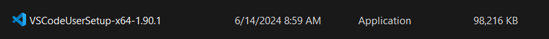
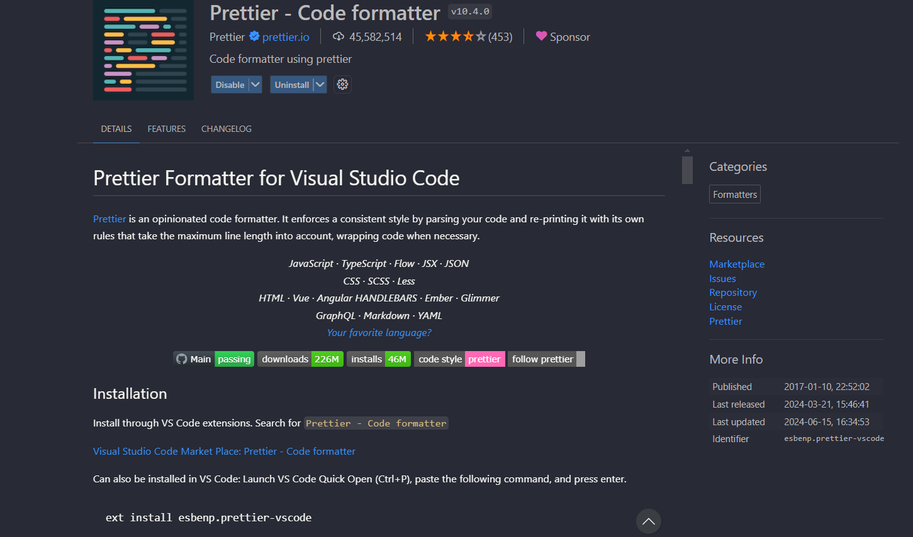
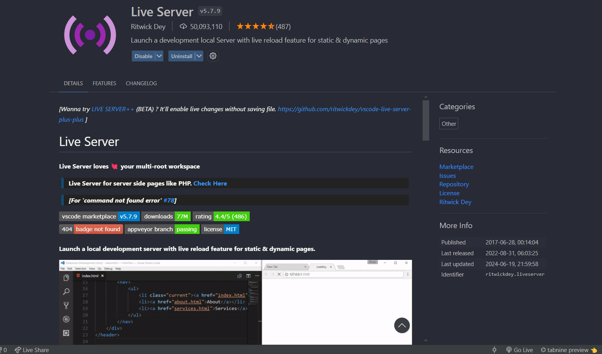
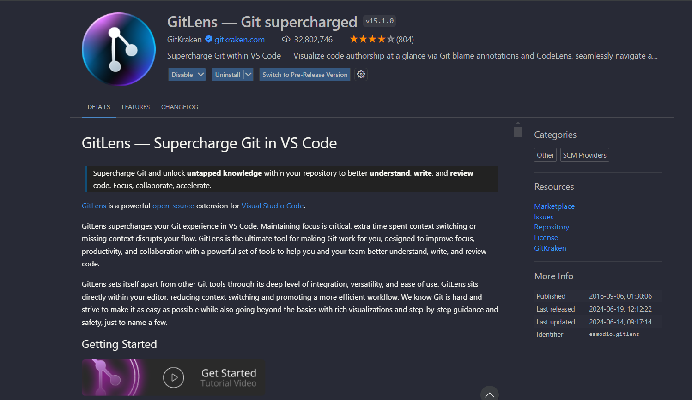
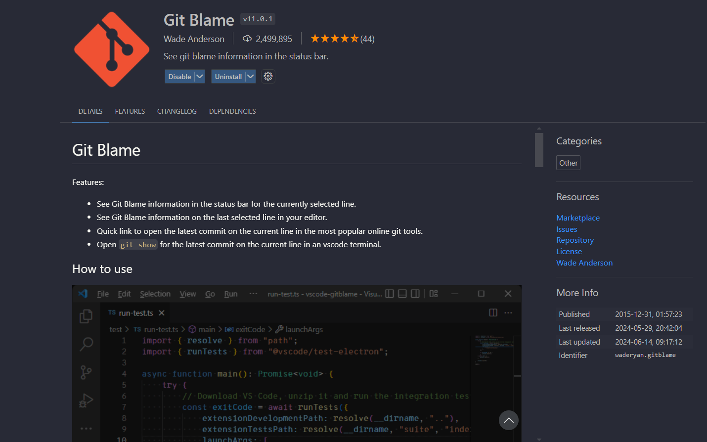
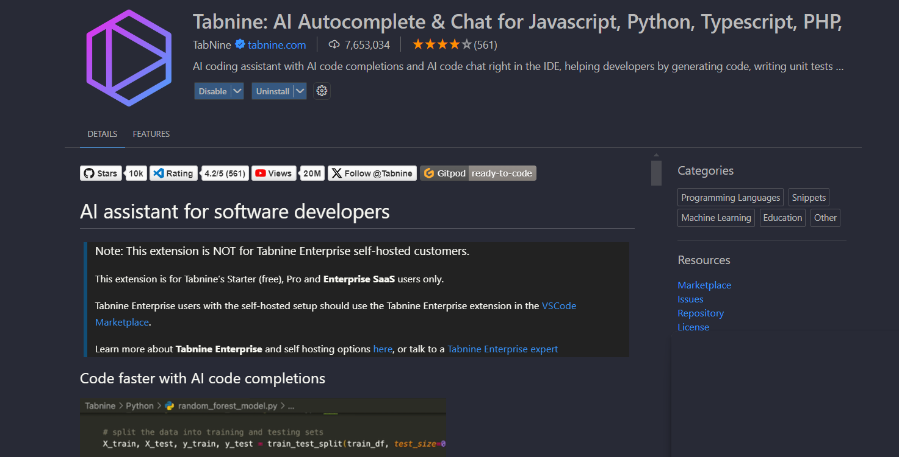
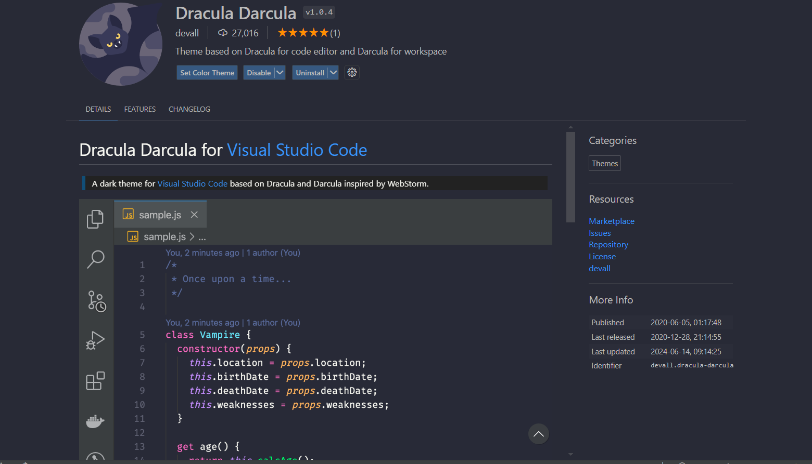
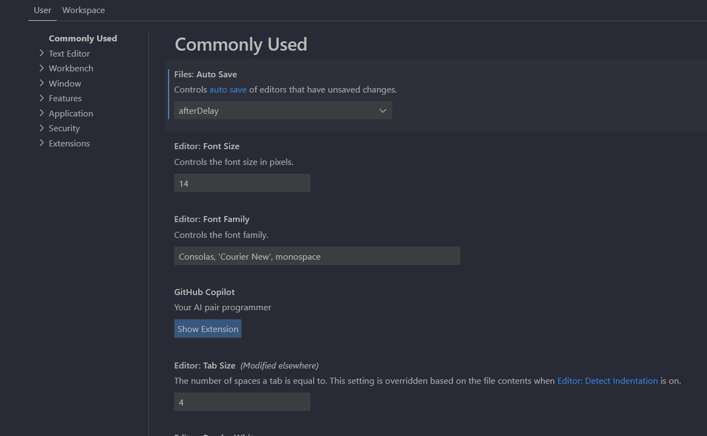

# SE-Assignment-5
Installation and Navigation of Visual Studio Code (VS Code)
 Instructions:
Answer the following questions based on your understanding of the installation and navigation of Visual Studio Code (VS Code). Provide detailed explanations and examples where appropriate.

 Questions:

1. Installation of VS Code:
   - Describe the steps to download and install Visual Studio Code on Windows 11 operating system. Include any prerequisites that might be needed.

Steps to Download and Install Visual Studio Code on Windows 11
Download Visual Studio Code
Visit the Visual Studio Code download page.
Click on the "Windows" button to download the installer.
Run the Installer
Locate the downloaded installer (e.g., VSCodeSetup-x64-<version>.exe) and double-click to run it.
If prompted by User Account Control, click "Yes" to allow the installer to make changes to your device.
Install Visual Studio Code
Follow the installation prompts
Accept the license agreement.
Choose the destination folder for installation.
Select additional tasks, such as adding VS Code to the PATH, creating a desktop icon, and associating file types.
Click "Install" to begin the installation.
Once the installation is complete, click "Finish" to launch VS Code.

2. First-time Setup:
   - After installing VS Code, what initial configurations and settings should be adjusted for an optimal coding environment? Mention any important settings or extensions.

Initial Configurations and Settings for an Optimal Coding Environment
Install Key Extensions
Open the Extensions view by clicking the Extensions icon in the Activity Bar or pressing Ctrl+Shift+X.
Install extensions like;
Prettier - Code formatter (for consistent code formatting)

Live Server (for a live preview of web pages)

GitLens (for enhanced Git capabilities)

Git Blame (for showing the author of the  code)

Tabnine preview (for code completion)

Configure Settings
Open the Settings by clicking on the gear icon in the lower-left corner and selecting "Settings" or pressing Ctrl+,.
Set your preferred theme: "workbench.colorTheme": "Dark+ (default dark)".

Adjust the font size: "editor.fontSize": 14.
Enable auto-save: "files.autoSave": "afterDelay".

Set Up Workspace
Open a folder that you will be working in by selecting "File" > "Open Folder..." and navigate to your project directory.

3. User Interface Overview:
   - Explain the main components of the VS Code user interface. Identify and describe the purpose of the Activity Bar, Side Bar, Editor Group, and Status Bar.

Main Components of the VS Code User Interface
Activity Bar
Located on the far left side.
Provides access to different views like Explorer, Search, Source Control, Run and Debug, and Extensions.
Side Bar
Displays different views and UI elements depending on the selected activity.
For example, the Explorer view shows your project's folder and file structure.
Editor Group
The central area where you open and edit files.
Supports multiple editor groups, allowing you to split the view and work on multiple files simultaneously.
Status Bar
Located at the bottom of the window.
Provides information about the current file, such as encoding, line number, Git branch, and notifications.

4. Command Palette:
   - What is the Command Palette in VS Code, and how can it be accessed? Provide examples of common tasks that can be performed using the Command Palette.

The Command Palette is a powerful feature that provides quick access to many commands and settings.
Access it by pressing Ctrl+Shift+P or F1.
Examples of Common Tasks:
Open a file: Ctrl+P
Run a build task: Tasks: Run Build Task
Change the color theme: Preferences: Color Theme
Install extensions: Extensions: Install Extensions

5. Extensions in VS Code:
   - Discuss the role of extensions in VS Code. How can users find, install, and manage extensions? Provide examples of essential extensions for web development.

Role of Extensions and How to Manage Them
Extensions add functionality to VS Code, such as language support, themes, and tools.
Finding and Installing Extensions
Open the Extensions view (Ctrl+Shift+X).
Search for the desired extension and click "Install".
Managing Extensions
View installed extensions in the Extensions view.
Disable or uninstall extensions by clicking the gear icon next to each extension.
Essential Extensions for Web Development
HTML, CSS, and JavaScript Snippets
Live Server
ESLint
Prettier
GitLens

6. Integrated Terminal:
   - Describe how to open and use the integrated terminal in VS Code. What are the advantages of using the integrated terminal compared to an external terminal?

How to Open and Use the Integrated Terminal
Open the integrated terminal by pressing `Ctrl+`` (backtick) or selecting "View" > "Terminal".
Use the terminal just like any other command-line interface to run commands, scripts, or manage files.
Advantages
Directly integrated with the editor, providing a seamless development experience.
Allows you to run commands in the context of your workspace without switching windows.

7. File and Folder Management:
   - Explain how to create, open, and manage files and folders in VS Code. How can users navigate between different files and directories efficiently?

CreatING a New File or Folder
In the Explorer view, right-click on the folder and select "New File" or "New Folder".
Open a File
Use Ctrl+P to quickly open files by typing their name.
Navigate Between Files
Use Ctrl+Tab to switch between open files.
Use the breadcrumbs at the top of the editor to navigate the folder structure.

8. Settings and Preferences:
   - Where can users find and customize settings in VS Code? Provide examples of how to change the theme, font size, and keybindings.

Finding and Customizing Settings
Open the Settings by clicking on the gear icon in the lower-left corner and selecting "Settings" or pressing Ctrl+,.
Examples
Change the theme: "workbench.colorTheme": "Dark+ (default dark)"
Adjust font size: "editor.fontSize": 14
Customize keybindings: Open "Keyboard Shortcuts" from the gear icon or press Ctrl+K Ctrl+S to modify keybindings.

9. Debugging in VS Code:
   - Outline the steps to set up and start debugging a simple program in VS Code. What are some key debugging features available in VS Code?

Setting Up and Starting Debugging
Open the Debug View
Click on the Debug icon in the Activity Bar or press Ctrl+Shift+D.
Configure Launch Settings
Click on the gear icon to open launch.json.
Add the configuration for your programming language.
Start Debugging
Set breakpoints by clicking in the gutter next to the line numbers.
Click the green play button or press F5 to start debugging.
Key Debugging Features
Breakpoints, watch expressions, call stack, variable inspection, and step-through code.

10. Using Source Control:
    - How can users integrate Git with VS Code for version control? Describe the process of initializing a repository, making commits, and pushing changes to GitHub.

Integrating Git with VS Code
Initialize a Repository
Open the Source Control view by clicking the Source Control icon in the Activity Bar.
Click "Initialize Repository" to create a new Git repository.
Make Commits
Stage changes by clicking the "+" icon next to modified files.
Enter a commit message and click the checkmark icon to commit the changes.
Push Changes to GitHub
Open the Command Palette (Ctrl+Shift+P).
Type and select Git: Add Remote.
Enter the GitHub repository URL.
Push changes by clicking on the ellipsis (...) in the Source Control view and selecting Push.

 Submission Guidelines:
- Your answers should be well-structured, concise, and to the point.
- Provide screenshots or step-by-step instructions where applicable.
- Cite any references or sources you use in your answers.
- Submit your completed assignment by 1st July 

